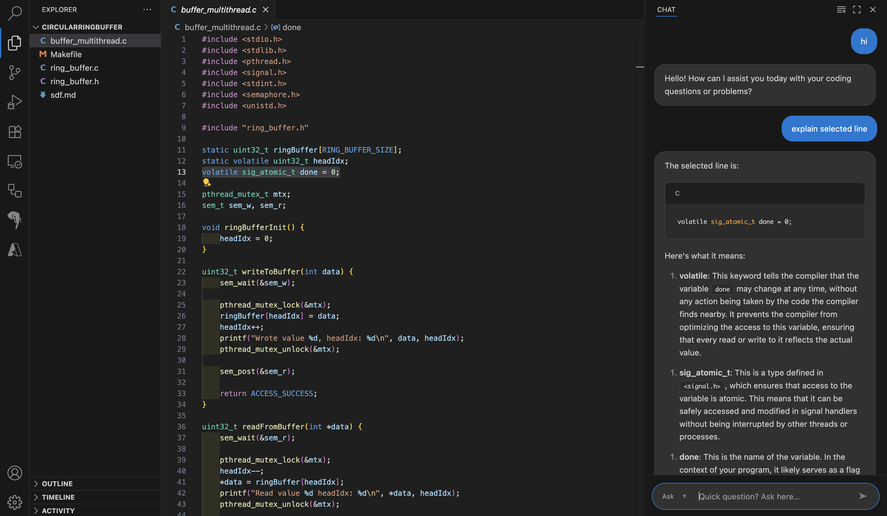

# DSP Cipher - VS Code Extension

GitHub Copilot clone for algorithmic problem solving and LeetCode challenges.

## Architecture

- **Frontend**: VS Code extension with chat interface
- **Backend**: Separate repository with AI processing
- **Communication**: WebSocket connection for real-time responses

## How it Works

1. User types message in VS Code chat panel
2. Extension sends request via **WebSocket** to backend server
3. Backend processes request using AI models
4. Response streams back through WebSocket
5. Chat interface displays AI-generated code/explanations

## Quick Test

1. Press **F5** to run extension
2. Click **🤖 robot icon** in Activity Bar
3. Type coding question and press Enter

**Note**: Backend server code is in a separate repository.
